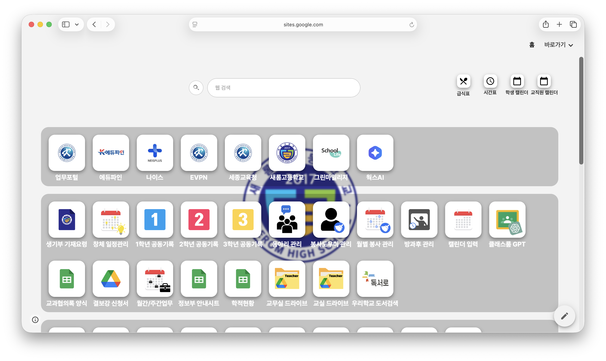
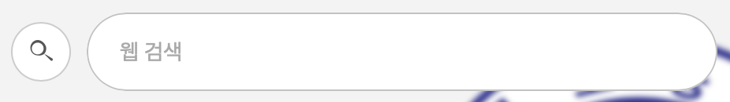
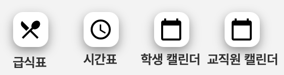
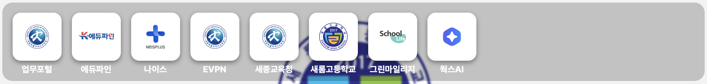

<h2><a href="https://sites.google.com/saerom.hs.kr/edu-main/홈">SAEROM-teacher_main</a></h2>

<h2>Purpose</h2>

이 프로젝트는 크롬북을 사용하는 학교에서 선생님들의 업무의 불편함을 해결하기 위해 선생님들의 편의를 중심으로 개발되었습니다.

<h2>Element</h2>
<h3>검색창</h3>

이 요소는 선생님들이 필요한 사이트나 정보를 빠르게 찾을 수 있도록 자주 사용하는 서비스와 데이터를 검색 기반으로 접근할 수 있게 제공합니다.

    
     
    

<h3>부가 기능</h3>

이 요소는 선생님들의 업무 편의성을 높일 수 있도록 자주 활용되는 보조 기능들을 하나의 환경에서 제공합니다.

    
     
    

<h3>웹 런처</h3>

이 요소는 선생님들이 자주 사용하는 웹 서비스를 빠르게 실행할 수 있도록 아이콘 기반의 웹 바로가기 기능을 제공합니다.

    
     
    

