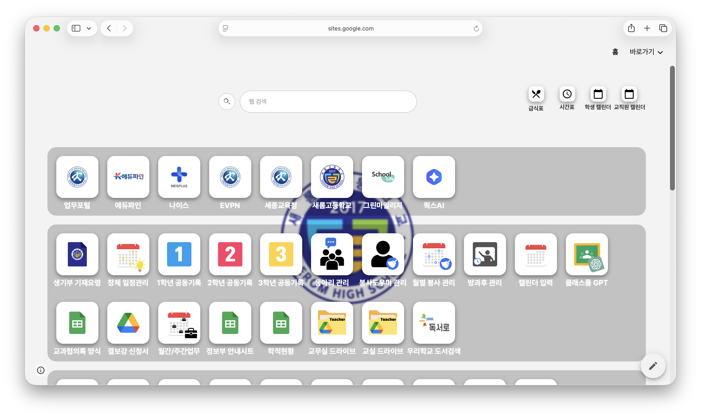
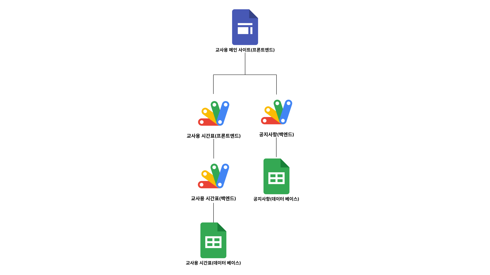
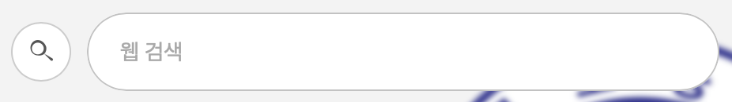
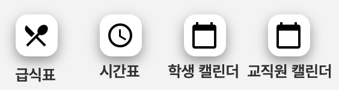
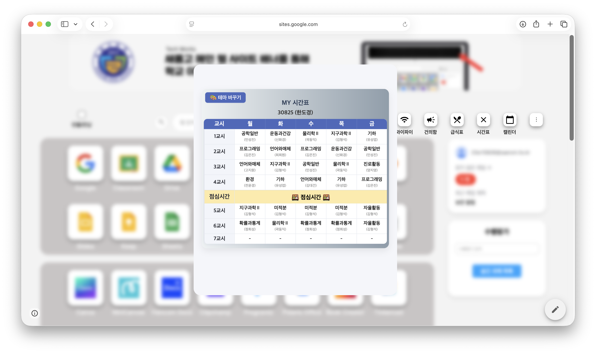
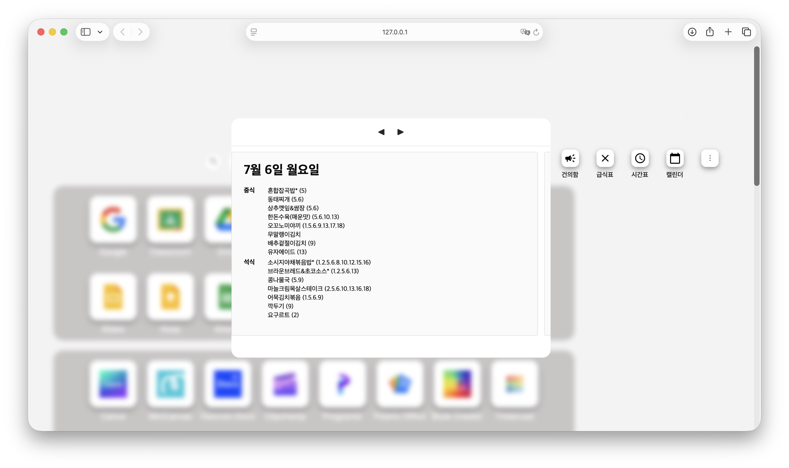
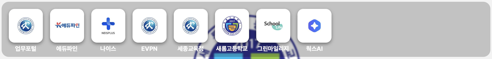

  <a href="https://sites.google.com/saerom.hs.kr/edu-main/홈">
    
     
    <b>SAEROM-teacher_main</b>
  </a>

  <b>디지털 업무의 불편함을 해결하는 교사 편의 중심의 웹 사이트</b>

  

---

## 목차
1. [소개](#소개)
2. [구조](#구조)
3. [기능](#기능)
4. [기여](#기여)
5. [라이선스](#라이선스)

---

## 소개

<table>
<tr>
<th>항목</th>
<th>내용</th>
</tr>
<tr>
<td>프로젝트명</td>
<td>SAEROM-teacher_main</td>
</tr>
<tr>
<td>개발 목적</td>
<td>이 프로젝트는 크롬북을 사용하는 학교에서 교사들의 업무의 불편함을 해결하기 위해 교사들의 편의를 중심으로 개발되었습니다.</td>
</tr>
<tr>
<td>개발 기간</td>
<td>2025.07 ~ 2026.01</td>
</tr>
<tr>
<td>개발 인원</td>
<td>3명</td>
</tr>
<tr>
<td>운영 환경</td>
<td>학교 노트북</td>
</tr>
<tr>
<td>사용자 수</td>
<td>약 100명</td>
</tr>
<tr>
<td>유지보수</td>
<td>TechWorks</td>
</tr>
<tr>
<td>서비스 상태</td>
<td>운영 중</td>
</tr>
<tr>
<td>Tech</td>
<td>
HTML
CSS
JavaScript
</td>
</tr>
<tr>
<td>Tool</td>
<td>
Google Sites
Google Apps Script
Google Sheets
</td>
</tr>
</table> 

---

## 구조

  

---

## 기능

<b>검색창</b>

 

  
   
  HTML
  CSS
  JavaScript
   
  Google Sites
   
  이 요소는 교사들이 필요한 사이트나 정보를 검색 기반으로 접근할 수 있는 기능을 제공합니다.

<b>부가 기능</b>

 

  
   
  HTML
  CSS
  JavaScript
   
  Google Sites
   
  이 요소는 교사들의 업무 편의성을 높일 수 있도록 부가 기능을 제공합니다.

  

  
<b>시간표</b>

   
  

    
     
    HTML
    CSS
    JavaScript
     
    Google Apps Script
    Google Sheets
     
    이 요소는 교사들이 시간표를 빠르게 확인할 수 있는 기능을 제공합니다.
  

  

  

  
<b>급식표</b>

   
  

    
     
    HTML
    CSS
    JavaScript
     
    Google Apps Script
    Google Sheets
     
    이 요소는 교시들이 급식표를 빠르게 확인할 수 있는 기능을 제공합니다.
  

  

<b>웹 런처</b>

 

  
   
  HTML
  CSS
   
  Google Sites
   
  이 요소는 교사들이 자주 사용하는 웹 서비스를 빠르게 실행할 수 있도록 아이콘 기반의 웹 바로가기 기능을 제공합니다.

---

## 기여

이 프로젝트는 TechWorks가 개발, 유지보수 하는 프로젝트입니다.
 
한도경, 강민서, 류우현

---

## 라이선스

Copyright © 2025 SAEROM HIGH SCHOOL All rights reserved.
 
본 프로젝트의 소스 코드, 디자인, 이미지 및 관련 에셋에 대한 모든 권리는 새롬고등학교에 있습니다.
